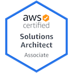
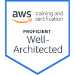
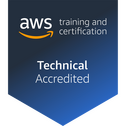
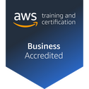

### Hi there 👋

- 👨‍💻 I'm a Solutions Architect and Cloud Engineer
- 💬 Ask me about AWS, Kubernetes, IaC and other things
- ☁ I'm an AWS Community Builder and [AWSug.nl](https://awsug.nl/about/) organizer
- 📫 Find me on:
  - 
  - 
  - 

- 🙋 About me: 
  - I am passionate about IoT, home automation, sensors and DIY
  - I love snowboarding 🏂, go around by motorbike 🏍, travel the 🌎 world 🌍 to discover new places and meet new cultures and I have a huge passion for pizza 🍕

---
`Certifications`

[Certification validaton](https://www.credly.com/users/angelo-malatacca)

---
`📕 Blog posts`
<!-- BLOG-POST-LIST:START -->
- [Backup and upgrade your EKS cluster with Velero and eksctl.](https://angelo-malatacca83.medium.com/backup-and-upgrade-your-eks-cluster-with-velero-and-eksctl-c12bea07aab9?source=rss-80236cd8348d------2)
- [Dr. Werner Vogels 2020 re:Invent 2020 keynote](https://angelo-malatacca83.medium.com/dr-werner-vogels-2020-re-invent-2020-keynote-ce128761ad44?source=rss-80236cd8348d------2)
- [AWS re:Invent 2020 announcement: S3 Strong Read-After-Write Consistency](https://angelo-malatacca83.medium.com/aws-re-invent-2020-announcement-s3-strong-read-after-write-consistency-ff3308e56c94?source=rss-80236cd8348d------2)
- [Build and keep your images up to date with AWS ImageBuilder](https://angelo-malatacca83.medium.com/build-and-keep-your-images-up-to-date-with-aws-imagebuilder-dddea519c84f?source=rss-80236cd8348d------2)
<!-- BLOG-POST-LIST:END -->

---
`📺 YouTube videos`
<!-- YOUTUBE:START -->
- [Terraform S3 and dynamoDB backend](https://www.youtube.com/watch?v=hvamD0jatqU)
<!-- YOUTUBE:END -->

---
`Nerd Stats`

---
`⚡ Recent Activity`

<!--START_SECTION:activity-->
<!--END_SECTION:activity-->

---

<!-- 

 
Icons:
https://github.com/alexandresanlim/Badges4-README.md-Profile/blob/master/README.md
https://gist.github.com/brennv/3e9a26308948f11d651f
-->
