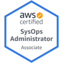

### Hi there 👋

- 👨‍💻 I'm a Solutions Architect and Cloud Engineer
- 💬 Ask me about AWS, Kubernetes, IaC and other things
- ☁ I'm an AWS Community Builder and [AWSug.nl](https://awsug.nl/about/) organizer
- 📫 Find me on:
  - 
  - 
  - 

- 🙋 About me: 
  - I am passionate about IoT, home automation, sensors and DIY
  - I love snowboarding 🏂, go around by motorbike 🏍, travel the 🌎 world 🌍 to discover new places and meet new cultures and I have a huge passion for pizza 🍕

---
`Certifications`

[Certification validaton](https://www.credly.com/users/angelo-malatacca)

---
`Nerd Stats`

<!-- 

 
Icons:
https://github.com/alexandresanlim/Badges4-README.md-Profile/blob/master/README.md
https://gist.github.com/brennv/3e9a26308948f11d651f
-->
