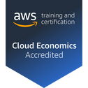

### Hi there 👋

- 👨‍💻 I'm a Solutions Architect and Cloud Engineer
- 💬 Ask me about AWS, Kubernetes, IaC and other things
- ☁ I'm an AWS Community Builder and [AWSug.nl](https://awsug.nl/about/) organizer
- 📫 Find me on:
  - 
  - 
  - 
  - 

- 🙋 About me: 
  - I am passionate about IoT, home automation, sensors and DIY
  - I love snowboarding 🏂, go around by motorbike 🏍, play table tennis 🏓 (ping pong), travel the 🌎 world 🌍 to discover new places and meet new cultures and I have a huge passion for pizza 🍕

---
`Certifications`

<!--START_SECTION:badges-->
<!--END_SECTION:badges-->

[Certification validaton](https://www.credly.com/users/angelo-malatacca)

---
`📕 Latest blog posts`
<!-- BLOG-POST-LIST:START -->
- [Stop your Amazon EC2 instances via AWS Lambda and receive an email notification via Amazon SNS or a…](https://angelo-malatacca83.medium.com/stop-your-amazon-ec2-instances-via-aws-lambda-and-receive-an-email-notification-via-amazon-sns-or-a-3689d920f94?source=rss-80236cd8348d------2)
- [This week at AWS](https://angelo-malatacca83.medium.com/this-week-at-aws-e786623e7352?source=rss-80236cd8348d------2)
- [This week at AWS](https://angelo-malatacca83.medium.com/this-week-at-aws-a38c76b9cbc1?source=rss-80236cd8348d------2)
- [This week at AWS](https://angelo-malatacca83.medium.com/this-week-at-aws-6bedbade2d4d?source=rss-80236cd8348d------2)
- [This week at AWS](https://angelo-malatacca83.medium.com/this-week-at-aws-ec4f44fc90b4?source=rss-80236cd8348d------2)
<!-- BLOG-POST-LIST:END -->

---
`📺 YouTube videos`
<!-- YOUTUBE:START -->
- [Terraform S3 and dynamoDB backend](https://www.youtube.com/watch?v=hvamD0jatqU)
<!-- YOUTUBE:END -->

---
`Nerd Stats`

---
`⚡ Recent Activity`

<!--START_SECTION:activity-->
<!--END_SECTION:activity-->

---
<!-- 

-->

<!-- 

https://github.com/codeSTACKr/awesome-github-profile-readme 
Icons:
https://github.com/alexandresanlim/Badges4-README.md-Profile/blob/master/README.md
https://gist.github.com/brennv/3e9a26308948f11d651f
-->
